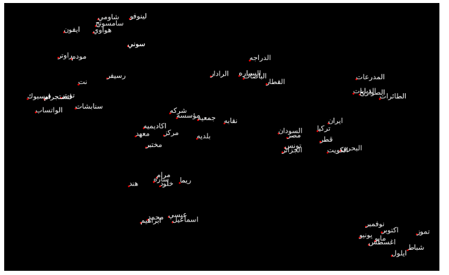

# AraETEWordVec


We provide our paper with code used for that research from first stage of collecting more than 350 million tweet, to provide free word embedding in Arabic language and run on different dataset to see the model ability compared to other available models.

This work compared to famous paper AraVec by Abu Bakr and his teammates and other papers.

## Full-Gram Models

| Description | Tweets No. | Tokens No. | Vocab No. | Vec-Size | Model Download Link |
| --- | --- | --- | --- |  --- | --- |
| Twitter CBOW | 189,141,269 | 7,019,276,208 | 2,027,042 | 300-d | [Twitter CBOW-300d](https://drive.google.com/drive/folders/1zkzBhVlb0hTnN5bU59HTGFOh2w4Wj_Pq?usp=sharing) |
| Twitter Skip-Gram | 189,141,269 | 7,019,276,208 | 2,027,042 | 300-d | [Twitter Skip-Gram-300d](https://drive.google.com/drive/folders/1Xov6HTWUuZ3bBHtzFFE_zbA2AZ-9pdBF?usp=sharing) |
| Twitter Skip-Gram-Negative-Sampling | 189,141,269 | 7,019,276,208 | 2,027,042 | 300-d | [Twitter Skip-Gram-Negative-Sampling-300d](https://drive.google.com/drive/folders/1eVtFEcbzFPfg9wah4rw1w9ik-E4QGEl1?usp=sharing) |


Model    | Tweets No.     | Tokens No. | Vocab No. | Vec-Size		| Download      |
-----    | --------       | ----------  |           | ---------	    | --------- 	|

Twitter CBOW| 189,141,269|7,019,276,208  |2,027,042           | 300-	    | --------- 	|

Twitter Skip-Gram    | --------          | ----------  |           | ---------	    | --------- 	|
Twitter Skip-Gram-Negative-Sampling       | --------          | ----------  |           | ---------	    | --------- 	|

## How to use to get Similar words & others

Once you download the model you need, check the "notebook/compare_3.ipynb", you will see different comparison from other models with our models.

**Some codes, but you have to check the full code you will enjoy that**

```

import gensim
from sklearn.decomposition import PCA
from bidi.algorithm import get_display
import matplotlib.pyplot as plt
from sklearn.manifold import TSNE
import arabic_reshaper
import pandas as pd
from word2vec_results import *


# Once you download the model from drive link you can pass the direction of
# any model you need

# Example
rezk_model = gensim.models.Word2Vec.load("model_dir/continuous_bow_fullgram_vec_size_300-d_min_count_100")

similar_tokens = rezk_model.wv.most_similar('🤣')
print(similar_tokens)

'''
[('😆', 0.8333120942115784),
 ('😁', 0.8321138024330139),
 ('😜', 0.8205730319023132),
 ('😏', 0.819418728351593),
 ('😅', 0.8010570406913757),
 ('😒', 0.7967824339866638),
 ('هه', 0.7967004776000977),
 ('😂', 0.7781848907470703),
 ('😬', 0.7624844312667847),
 ('😀', 0.7618412375450134)]
'''

text = text_to_clean('كوفيد').replace(' ', '_')
similar_tokens = rezk_model.wv.most_similar(text)
print(similar_tokens)

'''
[('كوفيد-', 0.8830006122589111),
 ('كوفيد_', 0.8637586832046509),
 ('Covid', 0.7545498609542847),
 ('بكوفيد', 0.7023125886917114),
 ('الكوفيد', 0.6937721967697144),
 ('كورونا', 0.6714788675308228),
 ('كوڤيد', 0.6528131365776062),
 ('COVID', 0.6056150794029236),
 ('بـكوفيد-', 0.600813090801239),
 ('فيروس', 0.5611270666122437)]
'''
text = text_to_clean('منصه مدرستي').replace(' ', '_')
similar_tokens = rezk_model.wv.most_similar(text)
print(similar_tokens)

'''
[('تعليم_جده', 0.6406617164611816),
 ('لعوده_حضوريه_امنه', 0.6082739233970642),
 ('تعليم_المخواه', 0.6013671159744263),
 ('تعليم_الطائف', 0.5990505814552307),
 ('الملف_الاعلامي_بوزاره_التعليم', 0.5927740931510925),
 ('تعليم_عسير', 0.5926639437675476),
 ('تعليم_مكه', 0.5854555368423462),
 ('تعليم_الرياض', 0.581294059753418),
 ('تعليم_الرس', 0.5742909908294678),
 ('تعليم_القصيم', 0.5729984641075134)]

'''


# Using functions in side word2vec_results.py to display graphs in image below

# Reduce the dimension of NER_WORDS
tsne_df_scale = tsne_graph(rezk_model, NER_WORDS, 1400, .03)

_ = init_graph_style(figsize=(16, 10))

_ = word_display(tsne_df_scale, NER_WORDS, "NER_WORDS.png")

```




## How to use to train your ML or DL Model

Once you download the model you need, check the "test_models/", you will see different ML models and DL models that you can train with the related datasets.


